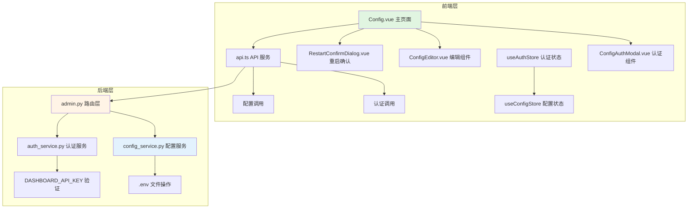

# 设计文档

## 概述

**配置管理改版** 功能将现有的只读配置查看器升级为完整的配置管理系统。该系统采用安全优先的设计理念，默认以只读模式运行，仅在通过 DASHBOARD_API_KEY 认证后才允许编辑配置。系统采用前后端分离架构，后端提供安全可靠的配置管理 API，前端提供直观易用的配置编辑界面。

## 文档对齐

### 技术标准遵循

本项目遵循现有的技术栈和架构模式：

**后端技术栈**：
- FastAPI 0.115.5：提供异步 RESTful API
- Pydantic：数据验证和序列化
- Python-dotenv：环境变量管理
- 文件锁机制：确保并发安全

**前端技术栈**：
- Vue 3 + TypeScript：组件化框架
- Pinia：状态管理
- TailwindCSS：样式框架
- Composition API：逻辑复用

### 项目结构对齐

```
backend/
├── routers/
│   └── admin.py                    # 扩展现有配置 API 端点
├── services/
│   ├── config_service.py           # 新增：配置管理服务
│   └── auth_service.py             # 新增：认证服务
├── schemas/
│   └── config.py                   # 新增：配置数据模型
└── utils/
    └── file_lock.py                # 新增：文件锁工具

frontend/src/
├── views/
│   └── Config.vue                  # 改造现有配置页面
├── components/
│   ├── ConfigAuthModal.vue         # 新增：认证模态框
│   ├── ConfigEditor.vue            # 新增：配置编辑器
│   └── RestartConfirmDialog.vue    # 新增：重启确认对话框
└── stores/
    └── index.ts                    # 扩展现有状态管理
```

## 代码复用分析

### 现有组件复用

- **backend/routers/admin.py**：扩展现有的 `/api/admin/config` 端点，复用认证依赖注入框架
- **backend/config.py**：复用环境变量加载逻辑，扩展 `.env` 文件读写能力
- **frontend/src/services/api.ts**：复用现有的配置 API 调用，扩展认证相关方法
- **frontend/src/stores/index.ts**：复用现有的 `useConfigStore` 和 `useAuthStore`
- **frontend/src/views/Config.vue**：基于现有页面进行功能增强

### 集成点分析

- **认证系统集成**：与现有的 FastAPI 依赖注入系统集成
- **状态管理集成**：扩展现有 Pinia stores，保持状态管理一致性
- **API 接口集成**：保持现有 API 结构，扩展新功能端点
- **UI 组件集成**：复用现有 TailwindCSS 样式，保持界面一致性

## 架构设计

### 模块化设计原则

- **单一文件职责**：每个文件处理特定领域或功能
- **组件隔离**：创建小型、专注的组件，避免大型单体文件
- **服务层分离**：数据访问、业务逻辑和展示层分离
- **工具模块化**：工具类拆分为专注、单一用途的模块

### 系统架构图



## 组件和接口设计

### 后端组件

#### 1. config_service.py - 配置管理服务

**目的**：封装 `.env` 文件读写逻辑，提供原子操作和备份功能

**接口**：
- `load_env() -> Dict[str, str]`：读取并解析 `.env` 文件
- `update_env(config: Dict[str, str]) -> bool`：原子性更新 `.env` 文件
- `create_backup() -> str`：创建 `.env` 文件备份
- `restore_backup(backup_path: str) -> bool`：从备份恢复文件

**依赖**：文件系统操作、锁机制、备份目录管理

**复用**：现有的 `dotenv` 库，扩展文件操作功能

#### 2. auth_service.py - 认证服务

**目的**：提供安全的 API Key 验证机制

**接口**：
- `verify_dashboard_api_key(api_key: str) -> bool`：验证 API Key
- `is_api_key_configured() -> bool`：检查是否配置了 API Key
- `require_auth() -> Callable`：FastAPI 认证依赖装饰器

**依赖**：`hmac.compare_digest` 常量时间比较

**复用**：现有的 `verify_dashboard_api_key` 函数逻辑

#### 3. schemas/config.py - 数据模型

**目的**：定义配置数据的结构和验证规则

**接口**：
- `ConfigEntry(key: str, value: str, type: str, description: str)`
- `ConfigUpdateRequest(config: Dict[str, str])`
- `ConfigResponse(config: Dict[str, str], read_only: bool, needs_restart: bool)`
- `ConfigMetadata(fields: List[ConfigEntry])`

**依赖**：Pydantic 基础模型

### 前端组件

#### 1. ConfigAuthModal.vue - 认证模态框

**目的**：提供安全的 API Key 输入和验证界面

**接口**：
- Props: `visible: boolean`, `loading: boolean`
- Events: `authenticate(apiKey: string)`, `close()`

**依赖**：Pinia auth store、API 服务

**复用**：现有的 TailwindCSS 模态框样式

#### 2. ConfigEditor.vue - 配置编辑器

**目的**：提供动态配置表单和实时验证

**接口**：
- Props: `initialConfig: Dict`, `readOnly: boolean`, `metadata: ConfigMetadata[]`
- Events: `save(config: Dict)`, `cancel()`

**依赖**：配置 store、表单验证库

**复用**：现有的表单样式和验证逻辑

#### 3. RestartConfirmDialog.vue - 重启确认对话框

**目的**：确认服务重启操作

**接口**：
- Props: `visible: boolean`, `message: string`
- Events: `restart-now()`, `restart-later()`

**依赖**：API 重启服务

**复用**：现有的对话框组件样式

## 数据模型

### 后端数据模型

```python
# 配置条目定义
class ConfigEntry(BaseModel):
    key: str
    value: str
    type: Literal["string", "number", "boolean", "json"]
    description: str
    required: bool = False
    default: Optional[str] = None

# 配置更新请求
class ConfigUpdateRequest(BaseModel):
    config: Dict[str, str]
    api_key: Optional[str] = None

# 配置响应
class ConfigResponse(BaseModel):
    config: Dict[str, str]
    read_only: bool
    api_key_configured: bool
    needs_restart: bool = False
    metadata: List[ConfigEntry]
```

### 前端数据模型

```typescript
// 配置条目
interface ConfigEntry {
  key: string
  value: string
  type: 'string' | 'number' | 'boolean' | 'json'
  description: string
  required?: boolean
  default?: string
}

// 配置状态
interface ConfigState {
  config: Record<string, any>
  isLoading: boolean
  readOnly: boolean
  apiKeyConfigured: boolean
  needsRestart: boolean
  metadata: ConfigEntry[]
}

// 认证状态
interface AuthState {
  isAuthenticated: boolean
  isLoading: boolean
  error: string | null
}
```

## 错误处理

### 后端错误场景

1. **认证失败**
   - **场景**：API Key 缺失或无效
   - **处理**：返回 401/403 状态码，明确的错误信息
   - **用户影响**：前端显示认证失败提示，保持只读模式

2. **文件操作失败**
   - **场景**：.env 文件写入权限不足、磁盘空间不足
   - **处理**：返回 500 状态码，记录详细日志
   - **用户影响**：前端显示"保存失败，请联系管理员"

3. **配置验证失败**
   - **场景**：提交的配置包含无效值或格式错误
   - **处理**：返回 422 状态码，详细的验证错误信息
   - **用户影响**：前端显示具体的字段验证错误

4. **并发写入冲突**
   - **场景**：多个用户同时保存配置
   - **处理**：使用文件锁，返回 409 状态码
   - **用户影响**：前端提示"配置正在被其他用户修改，请稍后重试"

### 前端错误处理

1. **网络错误**
   - **处理**：显示网络连接问题提示，提供重试选项
   - **恢复**：自动重试机制（最多 3 次）

2. **表单验证错误**
   - **处理**：实时显示字段级别的验证错误
   - **恢复**：用户修正输入后自动清除错误

3. **认证超时**
   - **处理**：认证状态过期，自动锁定编辑功能
   - **恢复**：提示用户重新认证

## 测试策略

### 单元测试

- **关键组件测试**：
  - `config_service.py` 的 `.env` 文件读写和原子操作
  - `auth_service.py` 的 API Key 验证逻辑
  - `ConfigEditor.vue` 的表单验证和状态管理
  - `ConfigAuthModal.vue` 的认证流程

### 集成测试

- **关键流程测试**：
  - 认证流程：从输入 API Key 到解锁编辑功能
  - 配置保存流程：从编辑表单到 .env 文件更新
  - 错误恢复：各种错误场景下的系统行为

### 端到端测试

- **用户场景测试**：
  - 只读模式下的页面显示
  - 完整的认证 → 编辑 → 保存 → 重启流程
  - 未配置 API Key 时的行为
  - 并发编辑冲突处理