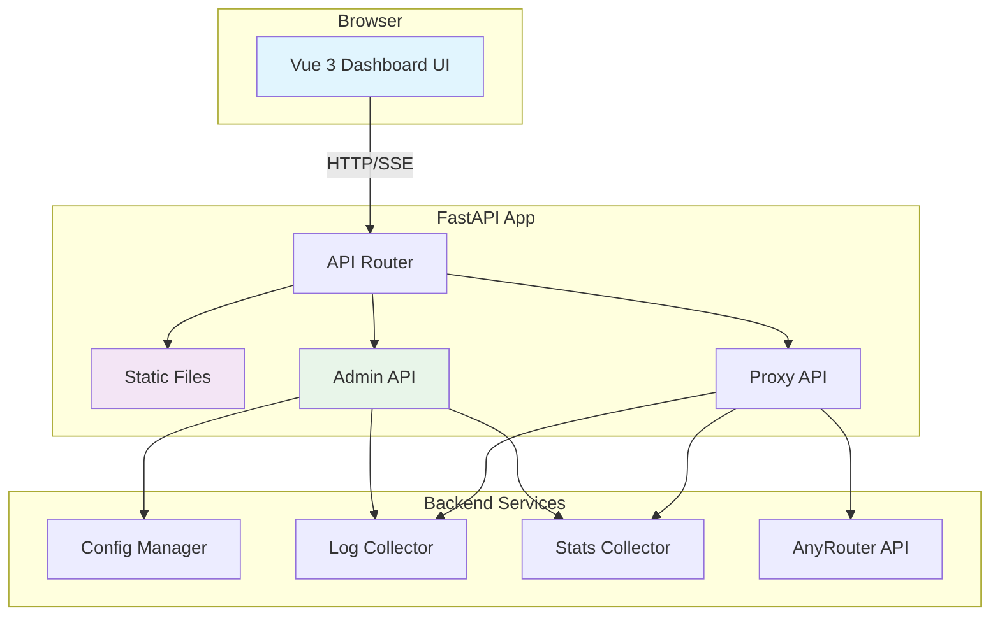

# Web 管理面板设计文档

## 概述

Web 管理面板是一个基于 Vue 3 + FastAPI 的全栈功能，为 AnyRouter Transparent Proxy 提供图形化管理界面。该功能通过子路径 `/admin` 集成到现有 FastAPI 应用中，提供仪表板、配置管理、实时监控和日志查看等核心功能，同时保持与现有代理功能的完全兼容。

## 指导文档对齐

### 技术标准 (tech.md)

设计严格遵循技术文档中定义的标准：

1. **架构选择**：采用 FastAPI 静态文件服务方案，保持单文件部署的简洁性
2. **异步优先**：所有后端 API 使用 async/await，前端使用 Vue 3 Composition API
3. **配置驱动**：通过环境变量 `ENABLE_DASHBOARD` 和 `DASHBOARD_API_KEY` 控制功能启用
4. **标准兼容**：遵循 RFC 7230 HTTP 标准，实施 Bearer Token 认证
5. **性能至上**：使用 SSE 实现实时数据，虚拟滚动处理大量日志

### 项目结构 (structure.md)

实现遵循项目结构文档的约定：

1. **命名规范**：
   - 文件：使用 kebab-case（如 `dashboard.vue`）
   - 组件：使用 PascalCase（如 `BaseLayout.vue`）
   - 环境变量：使用 UPPER_SNAKE_CASE

2. **模块化原则**：
   - 前端组件按功能分组（components/ui, components/charts）
   - 每个视图文件单一职责
   - 工具函数模块化（services, utils, types）

3. **代码组织**：
   - 保持 app.py 作为核心文件，仅添加必要的管理 API
   - 前端代码独立在 `frontend/` 目录
   - 构建产物输出到 `static/` 目录

## 代码复用分析

### 现有组件利用

1. **FastAPI 应用 (app.py)**
   - **复用**：现有的 `lifespan` 事件管理、`httpx.AsyncClient` 连接池
   - **扩展**：添加 `/admin` 静态文件路由和 `/api/admin/*` API 端点
   - **集成**：使用现有的环境变量加载和配置管理逻辑

2. **配置系统**
   - **复用**：`load_custom_headers()` 函数模式
   - **扩展**：创建 `load_dashboard_config()` 和 `update_config()` 函数
   - **复用**：JSON 配置文件解析逻辑

3. **日志系统**
   - **复用**：现有的日志前缀约定（`[Proxy]`, `[System Replacement]`）
   - **扩展**：添加 `[Dashboard]` 日志前缀
   - **复用**：日志格式化和调试模式逻辑

### 集成点

1. **代理服务集成**
   - 在 `proxy()` 函数中添加请求统计收集
   - 利用现有的错误处理机制记录错误信息
   - 复用连接状态追踪逻辑

2. **环境配置集成**
   - 与现有 `.env` 系统集成，添加 Dashboard 相关配置
   - 复用 `python-dotenv` 加载机制
   - 保持配置文件格式一致性

3. **Docker 部署集成**
   - 扩展现有 Dockerfile，添加前端构建步骤
   - 复用健康检查机制
   - 保持容器运行时配置

## 架构

### 整体架构

采用前后端集成架构，FastAPI 同时服务代理请求和静态文件：



### 模块化设计原则

1. **单一文件职责**：
   - `app.py`：仅添加 Dashboard 相关 API 和静态文件服务
   - 每个 Vue 组件：单一功能职责
   - 服务层：按功能分模块（config, logs, stats）

2. **组件隔离**：
   - UI 组件：可复用的基础组件
   - 视图组件：页面级组件
   - 组合函数：可复用的逻辑组合

3. **服务层分离**：
   - API 服务：HTTP 请求封装
   - 状态管理：Pinia stores
   - 工具函数：纯函数工具

4. **工具模块化**：
   - 类型定义：TypeScript 接口
   - 常量配置：环境相关常量
   - 格式化工具：日期、数字格式化

## 组件和接口

### 后端组件

1. **认证中间件 (DashboardAuth)**
   - **目的**：验证 Bearer Token
   - **接口**：`verify_api_key(request: Request) -> Optional[str]`
   - **依赖**：`DASHBOARD_API_KEY` 环境变量
   - **复用**：FastAPI 中间件机制

2. **配置管理器 (ConfigManager)**
   - **目的**：管理应用配置的读取和更新
   - **接口**：
     - `get_config() -> Dict[str, Any]`
     - `update_config(config: Dict[str, Any]) -> bool`
   - **依赖**：`os`, `json`, `python-dotenv`
   - **复用**：现有环境变量加载逻辑

3. **统计收集器 (StatsCollector)**
   - **目的**：收集和聚合请求统计
   - **接口**：
     - `get_realtime_stats() -> Dict[str, Any]`
     - `get_error_stats() -> List[ErrorInfo]`
   - **依赖**：内存缓存、时间窗口
   - **复用**：现有日志系统

4. **日志流 (LogStream)**
   - **目的**：提供实时日志流（SSE）
   - **接口**：`stream_logs() -> AsyncGenerator[str, None]`
   - **依赖**：`asyncio.Queue`, 日志处理器
   - **复用**：Python logging 系统

### 前端组件

1. **基础布局 (BaseLayout.vue)**
   - **目的**：提供响应式布局框架
   - **接口**：Props: `{ title: string }`
   - **依赖**：Vue Router, Tailwind CSS
   - **复用**：Tailwind 组件类

2. **仪表板视图 (Dashboard.vue)**
   - **目的**：展示系统概览和实时指标
   - **接口**：使用组合函数 `useDashboard()`
   - **依赖**：Chart.js, API services
   - **复用**：通用图表组件

3. **配置管理 (Config.vue)**
   - **目的**：提供配置编辑界面
   - **接口**：使用 `useConfig()` 组合函数
   - **依赖**：表单组件, API services
   - **复用**：通用输入组件

4. **监控中心 (Monitoring.vue)**
   - **目的**：实时监控和错误展示
   - **接口**：使用 `useMonitoring()` 组合函数
   - **依赖**：实时图表, 错误查看器
   - **复用**：SSE 连接管理

5. **日志查看器 (Logs.vue)**
   - **目的**：日志流展示和搜索
   - **接口**：使用 `useLogs()` 组合函数
   - **依赖**：虚拟滚动, 搜索过滤
   - **复用**：SSE 客户端

## 数据模型

### 统计信息模型
```typescript
interface SystemStats {
  timestamp: number;
  requests: {
    total: number;
    success: number;
    failed: number;
    ongoing: number;
  };
  performance: {
    qps: number;
    avgLatency: number;
    p99Latency: number;
    activeConnections: number;
  };
}
```

### 配置模型
```typescript
interface ConfigItem {
  key: string;
  value: string | number | boolean;
  type: 'string' | 'number' | 'boolean' | 'json';
  description: string;
  required: boolean;
  sensitive?: boolean;
}
```

### 错误信息模型
```typescript
interface ErrorInfo {
  id: string;
  timestamp: number;
  type: 'upstream' | 'network' | 'authentication' | 'validation';
  message: string;
  details?: any;
  requestId?: string;
  resolved: boolean;
}
```

### 日志条目模型
```typescript
interface LogEntry {
  timestamp: number;
  level: 'DEBUG' | 'INFO' | 'WARNING' | 'ERROR';
  prefix: string;
  message: string;
  metadata?: Record<string, any>;
}
```

## 错误处理

### 错误场景

1. **认证失败**
   - **处理**：返回 401 状态码，前端显示登录提示
   - **用户影响**：需要重新输入 API Key

2. **配置更新失败**
   - **处理**：验证配置格式，显示具体错误信息
   - **用户影响**：配置保持原值，显示错误提示

3. **SSE 连接断开**
   - **处理**：自动重连机制，指数退避策略
   - **用户影响**：短暂的数据中断，自动恢复

4. **静态文件加载失败**
   - **处理**：返回 404 或 500，显示错误页面
   - **用户影响**：无法访问管理界面

5. **API 请求超时**
   - **处理**：显示加载超时提示，提供重试按钮
   - **用户影响**：需要手动重试操作

## 测试策略

### 单元测试

1. **后端 API 测试**
   - 测试认证中间件的各种场景
   - 测试配置管理器的读取和更新逻辑
   - 测试统计收集器的数据聚合

2. **前端组件测试**
   - 测试 Vue 组件的渲染和交互
   - 测试组合函数的逻辑
   - 测试 Pinia store 的状态管理

3. **工具函数测试**
   - 测试格式化函数
   - 测试验证函数
   - 测试类型转换函数

### 集成测试

1. **API 集成测试**
   - 测试前后端 API 交互
   - 测试 SSE 连接和数据流
   - 测试错误处理流程

2. **配置集成测试**
   - 测试配置更新的完整流程
   - 测试配置持久化和重载
   - 测试无效配置的处理

3. **代理集成测试**
   - 测试统计数据的收集
   - 测试日志的生成和传输
   - 测试性能指标的准确性

### 端到端测试

1. **用户场景测试**
   - 完整的配置管理流程
   - 实时监控的使用场景
   - 日志查看和搜索功能

2. **浏览器兼容性测试**
   - 主流浏览器的功能测试
   - 移动设备响应式测试
   - 不同屏幕尺寸适配测试

3. **性能测试**
   - 大量日志数据的处理性能
   - 实时图表的渲染性能
   - 长时间运行的稳定性测试